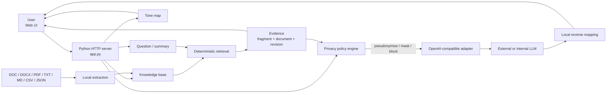
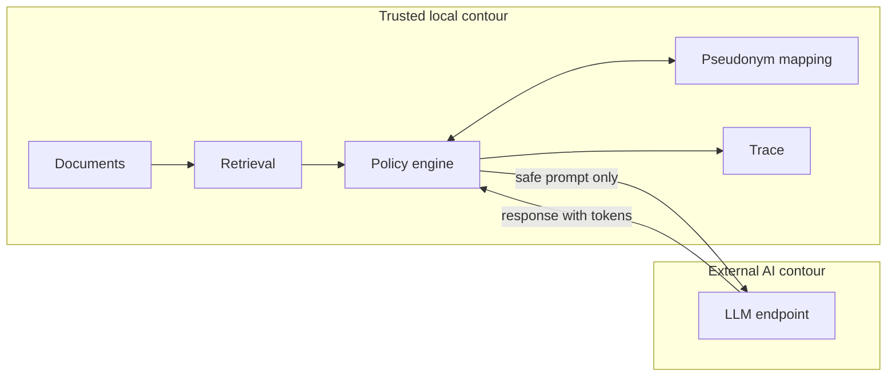
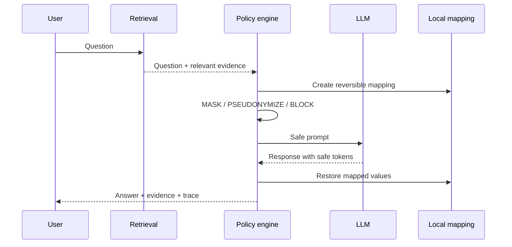

<div align="center">

# Policy Assistant

**Verifiable AI for corporate policies with local data protection**

Grounded answers · source evidence · local knowledge base · document tone map · reversible pseudonymization

[Русский](README.md) · [Demo presentation](docs/Нормативный_помощник_демо.pdf) · [Architecture portfolio](https://nesmachnydn.github.io/)


</div>

---

## Case in two minutes

Corporate policies are a poor fit for a generic chatbot: an answer must be not only plausible but **verifiable against specific document fragments**. At the same time, sending corporate context to an external LLM creates a separate data-exposure risk.

This prototype addresses both concerns in one architecture:

1. extracts and indexes policy documents locally;
2. deterministically retrieves relevant fragments while preserving provenance;
3. applies policy-controlled transformation of sensitive entities before an external AI call;
4. sends only a safe prompt containing the retrieved evidence;
5. restores mapped values locally and returns the answer together with sources and trace data.

The LLM is therefore used as an **explanation layer**, not as the source of corporate facts.

> Project context: a time-boxed AI hackathon. The public repository contains publication-safe code, synthetic demo fixtures and technical artifacts only. The original internal document package is intentionally excluded from Git.

## What this case demonstrates

- turning a business problem into an end-to-end working prototype under tight time constraints;
- explicit trust-boundary design between a local trusted contour and an external LLM;
- grounded generation with visible provenance;
- privacy-by-design with pseudonymize / mask / block actions before network transmission;
- reversible transformation for useful external-AI responses without exposing source identifiers;
- graceful degradation when the LLM is unavailable;
- local document processing for DOC/DOCX/PDF/TXT/MD/CSV/JSON;
- inspectable outbound payloads and transformation trace;
- an independent local readability/tone analysis feature;
- a 59-test regression suite.

### My role

**Solution architecture · product framing · technical decisions · delivery orchestration · AI-assisted engineering**

I defined the architecture, trust boundaries, user scenarios, verifiability requirements and security model. Implementation was delivered through an AI-assisted engineering workflow with regression and runtime validation.

## Why this is more than “chat with PDFs”

| Typical approach | This solution |
| --- | --- |
| Large document context is sent to the model without explicit control | Local retrieval selects relevant evidence first |
| Model output is persuasive but provenance is opaque | The UI returns exact source fragments, document and revision |
| Corporate names and contact data may leave the trusted environment | A local policy engine transforms data before the call |
| Simple masking destroys useful context | Reversible pseudonyms are restored after the response |
| Having an API key implies that any payload may be sent | Credentials and secrets are hard-blocked by policy |
| LLM outage disables the product | Deterministic local retrieval still works |
| Policy readability is assessed manually | A dedicated local tone/readability map highlights difficult sections |

## Architecture



### Trust boundaries



Documents, pseudonym mappings and value restoration stay local. Only a policy-approved payload is sent to the external AI endpoint.

## Key architecture decisions

| Problem | Decision | Rationale |
| --- | --- | --- |
| Hallucination in policy answers | Give the LLM only already-retrieved fragments | The model explains evidence instead of inventing policy |
| Source identifiers must not cross the trust boundary | Local pseudonymization and masking | Minimize disclosed corporate context |
| Some data must never be sent | Non-overridable `BLOCK` for credentials | Fail closed for high-risk categories |
| The answer must retain useful business context | Reversible token mapping | Restore original names only after the response returns |
| Heavy infrastructure is unjustified for a hackathon | Single Python process and local corpus | Fewer moving parts and fast setup |
| External AI can fail | Deterministic local fallback | Core functionality remains usable |
| Security must be demonstrable | Trace transformed prompt, payload and raw response | The boundary is inspectable rather than implicit |

## Protected AI call



Example:

```text
Source:
Company NorthGas uses the DocFlow-X system.
Contact: demo.user@example.org

Outbound:
Company [[ORG_001]] uses the [[SYSTEM_001]] system.
Contact: [[EMAIL_MASKED_001]]
```

## Product capabilities

| Capability | User outcome |
| --- | --- |
| **Situation Q&A** | Short plain-language answer grounded in policy documents |
| **Source evidence** | Exact fragments, document and revision |
| **Context-aware retrieval** | Similar policies can be distinguished by role and metadata |
| **Conflict handling** | Conflicting provisions are surfaced explicitly |
| **Structured summary** | Topic, audience, requirements, prohibitions, rights and changes |
| **Knowledge-base ingestion** | New documents can be added through the UI |
| **Tone map** | Readability, directive language and adaptation hotspots |
| **Protected AI mode** | Sensitive values are transformed before an external call |
| **Configurable policy** | Pseudonymize / mask / allow by data category |
| **Secret blocking** | Credentials, bearer tokens and private keys are not sent |
| **Inspectable outbound** | Transformed prompt and actual request JSON are visible |
| **Fallback mode** | Local evidence retrieval works even when the LLM does not |

## Trade-offs

This is intentionally a compact hackathon prototype rather than a production RAG platform.

The prototype deliberately uses:

- deterministic lexical retrieval rather than a dedicated vector database;
- a local JSON corpus rather than an enterprise document store;
- single-process deployment rather than microservices;
- rule-based sensitive-data detection rather than an enterprise DLP/NER stack;
- local readability heuristics rather than a separate ML model.

This keeps the system focused on validating the important architecture hypotheses. A production path would add enterprise document storage, hybrid/vector retrieval, a dedicated policy service, audit persistence, SSO/RBAC, DLP/NER, observability and deployment hardening.

## Supported documents

`TXT` · `MD` · `CSV` · `JSON` · `DOC` · `DOCX` · `PDF`

Processing is local. Legacy `.doc` files are temporarily converted with LibreOffice; DOCX is parsed locally and PDF extraction uses `pypdf`.

The original hackathon documents and user uploads stay local and are excluded from Git. The public repository runs on synthetic fixtures from `demo/`.

## Quick start

```bash
git clone https://github.com/NesmachnyDN/cps-hackathon-summary.git
cd cps-hackathon-summary

python3 -m venv .venv
.venv/bin/python -m pip install -r requirements.txt
```

The application can run on the local demo corpus without an external LLM.

### Groq demo profile

```bash
./scripts/run_groq_proxy.sh
```

If `GROQ_API_KEY` is not set, the launcher asks for it using hidden terminal input.

```text
http://127.0.0.1:8001
```

Example runtime configuration:

```text
LLM_PROFILE=groq
GROQ_MODEL=openai/gpt-oss-120b
GROQ_API_KEY=<runtime secret>
GROQ_PROXY_URL=http://127.0.0.1:10809
```

The key is runtime-only and must not appear in Git, UI, trace or logs. Other OpenAI-compatible endpoints can be used without changing the business logic.

### Docker

```bash
docker build -t cps-hackathon-summary .
docker run --rm -p 8000:8000 cps-hackathon-summary
```

## Demo path

1. Ask a policy question and inspect exact source fragments.
2. Generate a structured summary and ingest a new document.
3. Open the tone map and inspect difficult/directive passages.
4. Use Protected AI mode to compare source text, safe outbound and restored answer.
5. Ask a question that is absent from the corpus and verify that the system returns “not covered by the provided documents” rather than hallucinating.

[Open the demo presentation](docs/Нормативный_помощник_демо.pdf)

## Validation

```bash
.venv/bin/python -m py_compile app.py tone_map.py
.venv/bin/python -m unittest tests/test_app.py
```

The current regression suite contains **59 tests** covering retrieval, file import, structured summaries, privacy policies, credential blocking, protected trace, knowledge-base ingestion, tone-map and negative-evidence scenarios.

## Repository layout

```text
.
├── app.py                         # API, retrieval, policy engine, LLM boundary
├── tone_map.py                    # local tone/readability analysis
├── static/index.html              # web UI
├── scripts/
│   ├── prepare_official_documents.py
│   └── run_groq_proxy.sh
├── demo/                          # synthetic publication-safe fixtures
├── prompts.json                   # AI system prompts
├── tests/test_app.py              # regression and security tests
├── docs/                          # spec, evidence, delivery and demo presentation
└── workflow/                      # development workflow state
```

## Design principles

**Local-first.** Documents, mappings and restoration stay local.

**Grounded AI.** The LLM explains retrieved evidence rather than replacing it.

**Fail-closed security.** Credentials cannot become allowed through a user preference.

**Verifiability.** Evidence and the actual outbound payload can be inspected.

**Graceful degradation.** External-AI failure does not eliminate the local capability.

**Minimal infrastructure.** The architecture is optimized for hypothesis validation, not component count.

---

<div align="center">

**[Dmitry Nesmachny](https://github.com/NesmachnyDN)** · Principal Solution Architect

From corporate policy to verifiable AI answers without losing control of the data.

</div>
