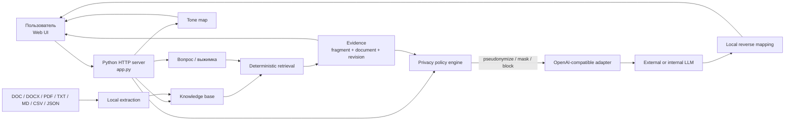
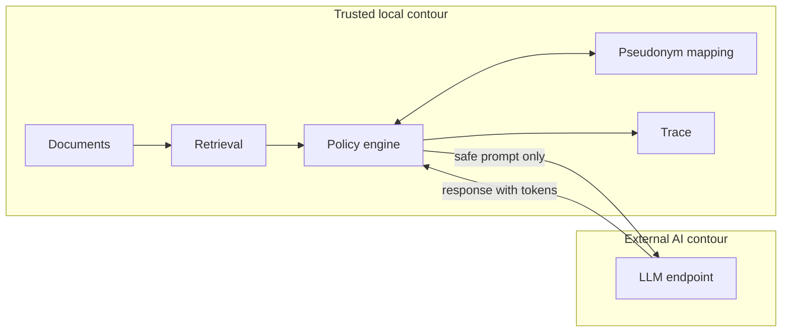
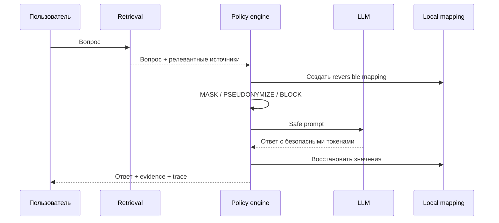

<div align="center">

# Нормативный помощник

**Проверяемый AI для корпоративных регламентов с локальной защитой данных**

Grounded answers · source evidence · local knowledge base · document tone map · reversible pseudonymization

[English](README.en.md) · [Демо-презентация](docs/Нормативный_помощник_демо.pdf) · [Архитектурное портфолио](https://nesmachnydn.github.io/)


</div>

---

## Кейс в двух минутах

Внутренние регламенты плохо подходят для обычного чат-бота: ответ должен быть не просто правдоподобным, а **проверяемым по конкретным фрагментам документов**. При этом передача корпоративного контекста во внешнюю LLM создаёт отдельный риск утечки чувствительных данных.

Этот прототип решает обе задачи одним архитектурным контуром:

1. локально извлекает и индексирует нормативные документы;
2. детерминированно находит релевантные фрагменты и сохраняет provenance;
3. перед внешним AI применяет policy-controlled преобразование чувствительных сущностей;
4. отправляет модели только безопасный prompt с найденными источниками;
5. локально восстанавливает значения в ответе и показывает пользователю источники и trace.

В результате LLM используется как **слой объяснения**, а не как источник корпоративных фактов.

> Контекст проекта: time-boxed AI hackathon. Публичный репозиторий содержит только publication-safe код, синтетический demo-корпус и технические артефакты. Исходный пакет внутренних документов в Git не публикуется.

## Что демонстрирует этот кейс

Для портфолио это прежде всего пример архитектурной работы в условиях жёсткого ограничения по времени:

- перевод бизнес-задачи в работающий end-to-end prototype;
- разделение локального trusted contour и внешней LLM boundary;
- grounded generation с явным provenance;
- privacy-by-design: pseudonymize / mask / block до сетевого вызова;
- reversible transformation для безопасного использования внешнего AI;
- graceful degradation при недоступности LLM;
- работа с DOC/DOCX/PDF/TXT/MD/CSV/JSON без внешнего document service;
- наблюдаемость: пользователь может увидеть фактический outbound и цепочку преобразований;
- независимый локальный анализ сложности и тона нормативных документов;
- регрессионный контур из 59 тестов.

### Моя роль

**Solution architecture · product framing · technical decisions · delivery orchestration · AI-assisted engineering**

Я определял архитектурную модель, границы доверия, продуктовые сценарии, требования к проверяемости и безопасности, а реализация велась в AI-assisted development workflow с обязательными тестами и runtime-проверками.

## Почему это не просто «чат над PDF»

| Типичный подход | В этом решении |
| --- | --- |
| Вся база передаётся модели или в RAG-пайплайн без явного контроля | Сначала локальный retrieval, затем только релевантные фрагменты |
| Ответ модели выглядит убедительно, но provenance скрыт | Пользователь получает дословные источники, документ и редакцию |
| PII/корпоративные имена могут уйти наружу | Локальная политика преобразует данные до сетевого вызова |
| Маскирование разрушает полезный контекст ответа | Псевдонимы обратимо восстанавливаются после ответа |
| Наличие API-ключа автоматически означает разрешённый вызов | Credentials и секреты блокируются policy engine |
| При падении LLM функция недоступна | Локальный retrieval остаётся работоспособным |
| Сложность регламентов оценивается субъективно | Есть отдельная карта понятности и директивности документа |

## Возможности

| Возможность | Что получает пользователь |
| --- | --- |
| **Вопрос по ситуации** | Короткий ответ простым языком по нормативной базе |
| **Подтверждение по источникам** | Дословные фрагменты, документ и редакция |
| **Различение похожих документов** | Учитываются роль, подразделение и контекст |
| **Контроль противоречий** | Конфликтующие нормы показываются явно |
| **Структурированная выжимка** | Тема, аудитория, требования, запреты, права и изменения |
| **База знаний** | Новый документ добавляется через UI и сразу участвует в поиске |
| **Карта тона** | Визуальная оценка сложности, директивности и зон для HR-адаптации |
| **Защищённый AI-режим** | Чувствительные значения преобразуются до внешней LLM |
| **Настраиваемая политика** | Для категорий данных доступны pseudonymize / mask / allow |
| **Hard block секретов** | Credentials, bearer tokens и private keys не отправляются наружу |
| **Проверяемый outbound** | Видны transformed prompt и фактический JSON запроса |
| **Безопасный fallback** | При недоступности LLM остаётся локальный ответ |

## Архитектура



### Границы доверия



Документы, mapping псевдонимов и обратное восстановление значений остаются в локальном контуре. Во внешний AI передаётся только policy-approved payload.

## Ключевые архитектурные решения

| Проблема | Решение | Зачем |
| --- | --- | --- |
| Hallucination в нормативном ответе | LLM получает только уже найденные фрагменты | Модель объясняет evidence, а не изобретает правило |
| Нельзя доверять внешнему контуру исходные сущности | Локальная псевдонимизация и masking | Снижается объём раскрываемого контекста |
| Некоторые данные нельзя отправлять даже в преобразованном виде | Неперекрываемый `BLOCK` для credentials | Fail-closed для наиболее опасных категорий |
| Ответ должен вернуть бизнес-контекст | Reversible token mapping | Пользователь получает естественный ответ с исходными именами |
| Хакатон не оправдывает тяжёлую инфраструктуру | Один Python process + local corpus | Минимальное число moving parts и быстрый запуск |
| Внешняя LLM может быть недоступна | Deterministic local fallback | Основная функция не зависит полностью от сети |
| Нужно доказать, что именно ушло наружу | Trace transformed prompt / payload / raw response | Проверяемость security boundary |

## Поток защищённого AI-вызова



Пример локального преобразования:

```text
Исходно:
Компания СеверГаз использует систему ДокФлоу-X.
Контакт: demo.user@example.org

Outbound:
Компания [[ORG_001]] использует систему [[SYSTEM_001]].
Контакт: [[EMAIL_MASKED_001]]
```

## Карта тона и понятности

Отдельная вкладка анализирует документ локально и подсвечивает участки, которые сложно читать или адаптировать для сотрудников.

Учитываются, в частности:

- длина и плотность предложений;
- длинные и сложные слова;
- канцелярские конструкции;
- пассивные и безличные формулировки;
- директивность и запреты;
- размер текстовых блоков.

Результат представлен как карта документа с индексом понятности и приоритетами адаптации.

## Trade-offs

Это намеренно компактный hackathon prototype, а не production RAG platform.

**Осознанно упрощено:**

- deterministic lexical retrieval вместо отдельной vector DB;
- локальный JSON-корпус вместо промышленного document store;
- single-process deployment вместо набора микросервисов;
- rule-based sensitive-data detection вместо enterprise DLP/NER stack;
- локальная tone-map эвристика вместо отдельной ML-модели.

Такая конфигурация позволила проверить главные архитектурные гипотезы без инфраструктурного шума. Production-эволюция очевидна: enterprise document storage, hybrid/vector retrieval, policy service, audit storage, SSO/RBAC, DLP/NER, observability и deployment hardening.

## Работа с документами

Поддерживаются:

`TXT` · `MD` · `CSV` · `JSON` · `DOC` · `DOCX` · `PDF`

Обработка выполняется локально. Старый `.doc` временно конвертируется LibreOffice в `.docx`; DOCX разбирается локально, PDF — через `pypdf`.

Официальный пакет хакатона и пользовательские загрузки хранятся только локально и исключены из Git. Публичный репозиторий использует синтетические fixtures из `demo/`.

## Быстрый запуск

```bash
git clone https://github.com/NesmachnyDN/cps-hackathon-summary.git
cd cps-hackathon-summary

python3 -m venv .venv
.venv/bin/python -m pip install -r requirements.txt
```

### Без внешней LLM

Приложение может работать с локальным demo-корпусом и deterministic fallback без API-ключа.

### С Groq через локальный proxy

```bash
./scripts/run_groq_proxy.sh
```

Если `GROQ_API_KEY` не задан, launcher запросит его скрытым вводом.

После запуска:

```text
http://127.0.0.1:8001
```

Основной demo-профиль:

```text
LLM_PROFILE=groq
GROQ_MODEL=openai/gpt-oss-120b
GROQ_API_KEY=<runtime secret>
GROQ_PROXY_URL=http://127.0.0.1:10809
```

API-ключ хранится только в runtime-окружении и не должен попадать в Git, UI, trace или логи.

Поддерживается и другой OpenAI-compatible endpoint без изменения бизнес-логики приложения.

### Docker

```bash
docker build -t cps-hackathon-summary .
docker run --rm -p 8000:8000 cps-hackathon-summary
```

## Демо-сценарий

1. **Спросить по ситуации** — получить ответ и дословные источники.
2. **Выжимка и база знаний** — показать структурированную выжимку и добавить новый документ.
3. **Карта тона документа** — найти сложные и директивные участки.
4. **Защита данных** — показать исходный текст, safe outbound и обратное восстановление.
5. **Negative evidence** — задать вопрос, которого нет в документах, и получить явное «не урегулировано», а не выдуманный ответ.

[Открыть демо-презентацию](docs/Нормативный_помощник_демо.pdf)

## API

| Метод | Endpoint | Назначение |
| --- | --- | --- |
| `GET` | `/api/status` | Состояние приложения и AI-профиля |
| `GET` | `/api/corpus` | Документы локальной базы знаний |
| `POST` | `/api/file` | Локальное извлечение текста |
| `POST` | `/api/normative/question` | Ответ по нормативной базе |
| `POST` | `/api/normative/summary` | Структурированная выжимка |
| `POST` | `/api/normative/ingest` | Добавление документа |
| `POST` | `/api/normative/tone-map` | Карта тона и понятности |
| `POST` | `/api/analyze` | Preview политики защиты |
| `POST` | `/api/process` | Защищённый внешний AI-вызов |
| `POST` | `/api/preflight` | Проверка AI-провайдера |

## Структура репозитория

```text
.
├── app.py                         # API, retrieval, policy engine, LLM boundary
├── tone_map.py                    # local tone/readability analysis
├── static/index.html              # web UI
├── scripts/
│   ├── prepare_official_documents.py
│   └── run_groq_proxy.sh
├── demo/                          # synthetic publication-safe fixtures
├── prompts.json                   # AI system prompts
├── tests/test_app.py              # regression and security tests
├── docs/                          # spec, evidence, delivery and demo presentation
└── workflow/                      # development workflow state
```

## Проверки

```bash
.venv/bin/python -m py_compile app.py tone_map.py
.venv/bin/python -m unittest tests/test_app.py
```

Текущий regression suite содержит **59 тестов**: retrieval, file import, structured summary, privacy policy, credential blocking, protected trace, knowledge-base ingestion, tone-map и negative-evidence scenarios.

## Принципы решения

**Local-first.** Документы, mapping и восстановление остаются локальными.

**Grounded AI.** LLM объясняет найденные источники, а не заменяет их.

**Fail-closed security.** Credentials не становятся допустимыми из-за пользовательской настройки.

**Verifiability.** Evidence и фактический outbound доступны для проверки.

**Graceful degradation.** Сбой внешней LLM не уничтожает локальную функцию.

**Minimal infrastructure.** Архитектура оптимизирована под проверку гипотезы, а не под демонстрацию количества компонентов.

---

<div align="center">

**[NesmachnyDN](https://github.com/NesmachnyDN)** · Principal Solution Architect

От корпоративного документа к проверяемому AI-ответу без потери контроля над данными.

</div>
