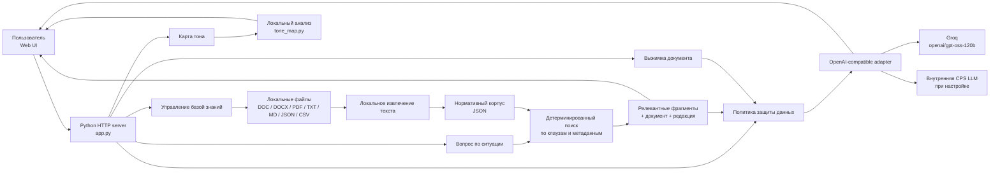
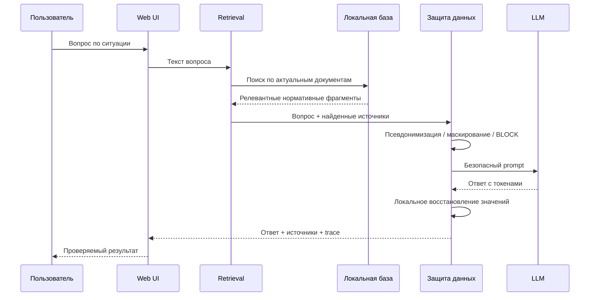
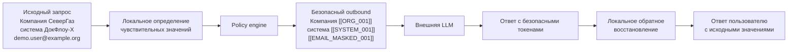

<div align="center">

# Нормативный помощник

**AI-сервис для работы с корпоративными нормативными документами**

Ответы с подтверждением по источникам · структурированные выжимки · локальная база знаний · карта тона и понятности · контролируемая защита данных при работе с внешним AI

[Репозиторий](https://github.com/NesmachnyDN/cps-hackathon-summary) · Python · Local-first · OpenAI-compatible LLM

</div>

---

## О проекте

Нормативный помощник помогает сотруднику быстро получить понятный ответ на вопрос по внутренним документам и сразу увидеть, **на какие конкретные фрагменты документов опирается ответ**.

Приложение объединяет детерминированный поиск по локальной базе нормативных документов и LLM. Модель не используется как самостоятельный источник фактов: сначала приложение находит релевантные нормативные фрагменты, а затем AI формирует короткое объяснение только на их основе.

Отдельный контур защиты данных позволяет до отправки запроса во внешний AI псевдонимизировать корпоративные сущности, маскировать контактные данные, блокировать credentials и локально восстанавливать исходные значения в полученном ответе.

## Что умеет приложение

| Возможность | Что получает пользователь |
| --- | --- |
| **Вопрос по ситуации** | Короткий ответ простым языком по действующим нормативным документам |
| **Подтверждение по источникам** | Дословные фрагменты, документ и редакция, на которых основан ответ |
| **Различение похожих документов** | Учитываются должность, подразделение и другие контекстные признаки |
| **Контроль противоречий** | При наличии конфликтующих норм приложение показывает это явно |
| **Структурированная выжимка** | Тема, аудитория, требования, запреты, права и изменения между редакциями |
| **База знаний** | Новый документ можно добавить через UI и сразу использовать в вопросах |
| **Карта тона документа** | Визуальная оценка сложности, директивности и участков для HR-адаптации |
| **Защищённый AI-режим** | Чувствительные значения преобразуются до внешней LLM и восстанавливаются локально |
| **Настраиваемая политика** | Для категорий данных можно выбрать псевдонимизацию, маскирование или разрешение |
| **Проверяемый outbound** | Видно, какой именно текст и JSON уходят во внешний AI |
| **Безопасный fallback** | При недоступности LLM остаётся локальный детерминированный ответ |

## Архитектура

Приложение выполнено как компактный локальный сервис: статический web-интерфейс обслуживается Python-процессом, а документы и индекс хранятся локально.



### Основные компоненты

| Компонент | Ответственность |
| --- | --- |
| `static/index.html` | Пользовательский интерфейс и демонстрационные сценарии |
| `app.py` | HTTP API, работа с документами, retrieval, policy engine, LLM boundary |
| `tone_map.py` | Локальный анализ сложности и коммуникационного тона документа |
| `official_documents_inbox/` | Локальное хранилище официальных документов и пользовательских загрузок |
| `scripts/prepare_official_documents.py` | Подготовка официального корпуса |
| `scripts/run_groq_proxy.sh` | Безопасный запуск Groq через локальный VPN proxy |
| `prompts.json` | Редактируемые системные инструкции для AI |
| `tests/test_app.py` | Регрессионные и security-проверки |

## Как формируется ответ по документам



LLM получает не всю базу документов, а только уже найденные релевантные фрагменты. Если в базе нет достаточного нормативного основания, приложение возвращает явный ответ **«в предоставленных документах это не урегулировано»**, а не генерирует предположение.

## Защита данных при работе с внешним AI

Политика выполняется локально **до сетевого вызова**.



Политика по умолчанию:

| Категория | Действие по умолчанию |
| --- | --- |
| Организация, система, проект, персона | `PSEUDONYMIZE` |
| Внутренний идентификатор | `PSEUDONYMIZE` |
| Email, телефон | `MASK` |
| Credentials, private keys, bearer tokens | `BLOCK` без возможности ослабления |
| Обычный текст | `ALLOW` |

На вкладке **«Защита данных»** можно локально проверить цепочку:

**исходные данные → безопасные данные для внешнего AI → восстановленные данные**

Preview не вызывает внешнюю модель. В рабочем запросе trace дополнительно показывает provider/route, policy mapping, transformed prompt, фактический JSON запроса, сырой ответ модели и результат после обратного преобразования. API-ключ в trace не попадает.

## Карта эмоционального тона и понятности

Отдельная вкладка помогает HR определить участки регламента, которые сложнее всего читать или адаптировать для сотрудников.

Анализ выполняется локально и оценивает, в частности:

- длину и плотность предложений;
- долю сложных и длинных слов;
- канцелярские конструкции;
- пассивные и безличные формулировки;
- директивность и запреты;
- размер текстовых блоков.

Результат представлен как карта документа с индексом понятности, оценкой коммуникационного тона и приоритетами адаптации.

## Работа с документами

Поддерживаются:

`TXT` · `MD` · `CSV` · `JSON` · `DOC` · `DOCX` · `PDF`

Обработка выполняется локально. Для старого `.doc` используется временная конвертация LibreOffice в `.docx`; временные файлы удаляются после обработки. DOCX разбирается локально, PDF — через `pypdf`.

Официальные документы хакатона находятся в `official_documents_inbox/` и исключены из Git. Пользовательские документы, добавленные через интерфейс в базу знаний, также сохраняются в локальном контуре.

## Быстрый запуск

### 1. Подготовить окружение

```bash
git clone https://github.com/NesmachnyDN/cps-hackathon-summary.git
cd cps-hackathon-summary

python3 -m venv .venv
.venv/bin/python -m pip install -r requirements.txt
```

### 2. Запустить приложение с Groq через локальный proxy

```bash
./scripts/run_groq_proxy.sh
```

Если `GROQ_API_KEY` ещё не задан, launcher запросит его в терминале скрытым вводом.

После запуска:

```text
http://127.0.0.1:8001
```

Launcher:

1. подготавливает официальный локальный корпус, если пакет документов присутствует; иначе приложение использует синтетический demo-корпус;
2. использует `GROQ_PROXY_URL=http://127.0.0.1:10809`;
3. выбирает профиль `groq`;
4. запускает приложение на порту `8001`;
5. безопасно заменяет предыдущий экземпляр этого же приложения, если он уже занимает порт.

### Docker

```bash
docker build -t cps-hackathon-summary .
docker run --rm -p 8000:8000 cps-hackathon-summary
```

## Настройка AI

Основной демонстрационный профиль:

```text
LLM_PROFILE=groq
GROQ_MODEL=openai/gpt-oss-120b
GROQ_API_KEY=<runtime secret>
GROQ_PROXY_URL=http://127.0.0.1:10809
```

Ключ хранится только в runtime-окружении и не должен попадать в Git, UI, trace или логи.

Также предусмотрен OpenAI-compatible профиль внутренней CPS LLM:

```text
LLM_PROFILE=cps
CPS_LLM_BASE_URL=<internal endpoint>
CPS_LLM_MODEL=<model>
CPS_LLM_API_KEY=<optional>
```

Переключение провайдера не требует изменения бизнес-логики приложения.

## Демо-сценарий

Для быстрой демонстрации комиссии удобно пройти четыре вкладки по порядку:

1. **Спросить по ситуации** — выбрать подготовленный вопрос, получить короткий ответ и показать дословные источники.
2. **Выжимка и база знаний** — показать структурированную выжимку, затем добавить новый документ в локальную базу.
3. **Карта тона документа** — открыть один из нормативных документов и показать сложные/директивные участки.
4. **Защита данных** — показать преобразование `СеверГаз / ДокФлоу-X / email` в безопасные токены, затем открыть trace реального AI-вызова.

Один из подготовленных вопросов намеренно спрашивает о корпоративном парковочном месте. В официальном пакете документов такой нормы нет, поэтому корректный результат — отказ от выдумывания ответа и сообщение, что вопрос документами не урегулирован.

## API

| Метод | Endpoint | Назначение |
| --- | --- | --- |
| `GET` | `/api/status` | Состояние приложения и AI-профиля |
| `GET` | `/api/corpus` | Документы локальной базы знаний |
| `POST` | `/api/file` | Локальное извлечение текста из файла |
| `POST` | `/api/normative/question` | Ответ на вопрос по нормативной базе |
| `POST` | `/api/normative/summary` | Структурированная выжимка |
| `POST` | `/api/normative/ingest` | Добавление документа в базу знаний |
| `POST` | `/api/normative/tone-map` | Карта тона и понятности |
| `POST` | `/api/analyze` | Локальный preview политики защиты |
| `POST` | `/api/process` | Защищённый внешний AI-вызов |
| `POST` | `/api/preflight` | Проверка доступности AI-провайдера |

## Структура репозитория

```text
.
├── app.py                         # HTTP API, retrieval, policy engine, LLM integration
├── tone_map.py                    # локальный анализ тона и понятности
├── static/
│   └── index.html                 # пользовательский интерфейс
├── scripts/
│   ├── prepare_official_documents.py
│   └── run_groq_proxy.sh
├── demo/                          # синтетические fixtures
├── official_documents_inbox/      # локальные документы, исключены из Git
├── prompts.json                   # системные AI prompts
├── tests/
│   └── test_app.py
├── docs/                          # спецификация, качество, evidence и submission
└── workflow/                      # текущее состояние development workflow
```

## Проверки

```bash
.venv/bin/python -m py_compile app.py tone_map.py
.venv/bin/python -m unittest tests/test_app.py
```

Проект содержит регрессионные проверки retrieval, файлового импорта, структурированных выжимок, privacy policy, блокировки credentials, защищённого trace, загрузки в базу знаний и карты тона.

## Принципы решения

**Local-first.** Документы, mapping псевдонимов и восстановление значений остаются в локальном контуре.

**Grounded AI.** LLM объясняет найденные нормативные источники, а не заменяет их.

**Проверяемость.** Пользователь видит цитаты и при необходимости точный outbound во внешний AI.

**Graceful degradation.** Недоступность внешней LLM не делает локальную нормативную базу бесполезной.

**Минимальная инфраструктура.** Для демонстрации не нужны отдельная БД, векторное хранилище или набор микросервисов.

---

<div align="center">

**NesmachnyDN/cps-hackathon-summary**

Нормативный помощник: от корпоративного документа к проверяемому ответу без потери контроля над данными.

</div>
